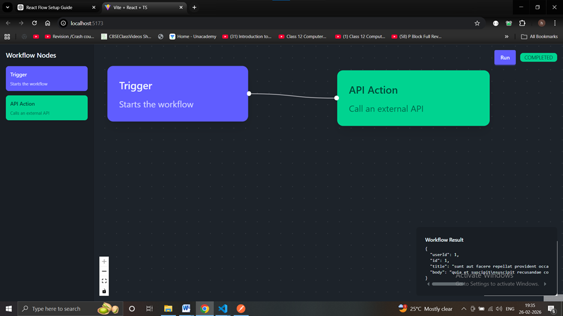

# Frontend Application (React + Vite)

This is a basic frontend application setup using **React** and **Vite**.  
Currently, the project contains only the initial setup with no business logic implemented.

---

## Prerequisites

Make sure you have the following installed:

- Node.js (v18 or above recommended)
- npm (comes with Node.js)

---

## Project Setup

### 1. Install Dependencies

Run the following command to install all required packages:

```bash
npm install
```
## Step 3: Start the Frontend Development Server

Once dependencies are installed, start the frontend application by running:

```bash
npm run dev
```
## Temporal Canvas App – Frontend Working Explanation

The Temporal Canvas App frontend is responsible for providing a user interface to trigger, monitor, and visualize Temporal workflows. It acts as a bridge between the user and the Temporal-powered backend APIs.

---

## 1. Purpose of the Frontend

The frontend application allows users to:

- Start a Temporal workflow
- Monitor workflow execution status
- View workflow results after completion
- Interact with backend APIs in a visual and user-friendly way

It does **not** execute workflows directly. All workflow logic runs inside the Temporal Worker on the backend.

---

## 2. Application Flow Overview

1. User interacts with the UI (e.g., clicks **Run Workflow**)
2. Frontend sends an API request to the backend
3. Backend triggers a Temporal workflow
4. Worker executes the workflow
5. Frontend polls backend for workflow status
6. UI updates based on workflow progress and result

---

## 3. UI Components and Responsibilities

### 3.1 Run Button (Workflow Trigger)

- A **Run** button is displayed on the canvas
- On click:
  - A `Get` request is sent to the backend (e.g. `/run`)
  - Backend responds with a `workflowId`

This `workflowId` is stored in frontend state for further tracking.

---

## 4. Workflow Status Polling

Once the workflow is started:

- Frontend initiates polling every **2 seconds**
- A `GET` request is sent to:


### Possible Workflow States:
- `Running`
- `Completed`
- `Failed`

The UI updates dynamically based on the returned status.

---

## 5. Handling Workflow Completion

When the workflow status becomes **Completed**:

- Polling stops automatically
- Frontend makes a final API call to fetch workflow result
- Result data is rendered on the screen

If the workflow **Fails**:
- Error state is shown
- Failure message is displayed to the user

---

## 6. State Management

The frontend maintains state for:

- `workflowId`
- `workflowStatus`
- `loading` indicator
- `workflowResult`
- `errorMessage`

This ensures smooth UI updates during workflow execution.

---

## 7. Backend Dependency

The frontend depends on the backend for:

- Starting workflows
- Fetching workflow status
- Fetching workflow results

> The frontend cannot function fully unless the backend server and Temporal worker are running.

---

## 8. Environment Variable Handling

Due to environment variable loading issues:

- API URLs are temporarily **hardcoded**
- `.env` file is not committed to GitHub
- This avoids GitHub secret scanning violations

This is a **temporary workaround** and will be fixed later.

---

## 9. Error Handling

The frontend handles errors such as:

- Backend not running
- Invalid workflow ID
- Network failures
- Workflow execution failure

Errors are displayed clearly in the UI.

---

## 10. Current Limitations

- No authentication
- Manual polling instead of WebSockets
- Hardcoded environment configuration
- Basic UI (focus on functionality)

---

## 11. Future Improvements

- WebSocket-based real-time updates
- Better UI/UX
- Authentication and role-based access
- Production-ready environment variable handling
- Workflow visualization enhancements

---

## 12. Summary

The Temporal Canvas App frontend provides a simple yet effective interface to interact with Temporal workflows. It focuses on:

✔ Triggering workflows  
✔ Monitoring execution status  
✔ Displaying results  
✔ Clear separation of frontend and backend responsibilities  

This design ensures scalability and aligns with Temporal best practices.

---


Loom Vidieo link of Application 
https://www.loom.com/share/44851fa797b4487a9a9c3e345e9797ca
